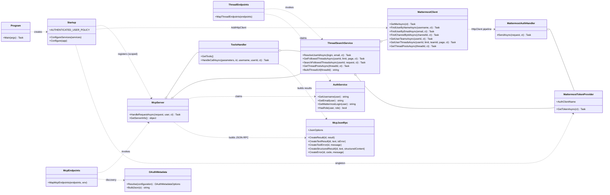
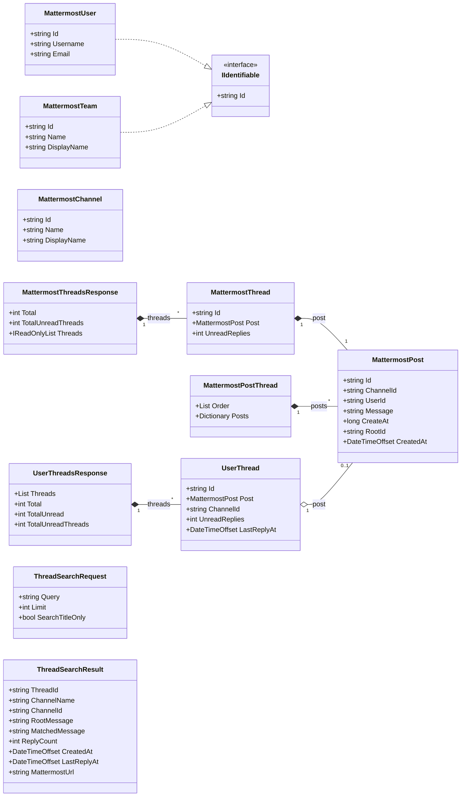
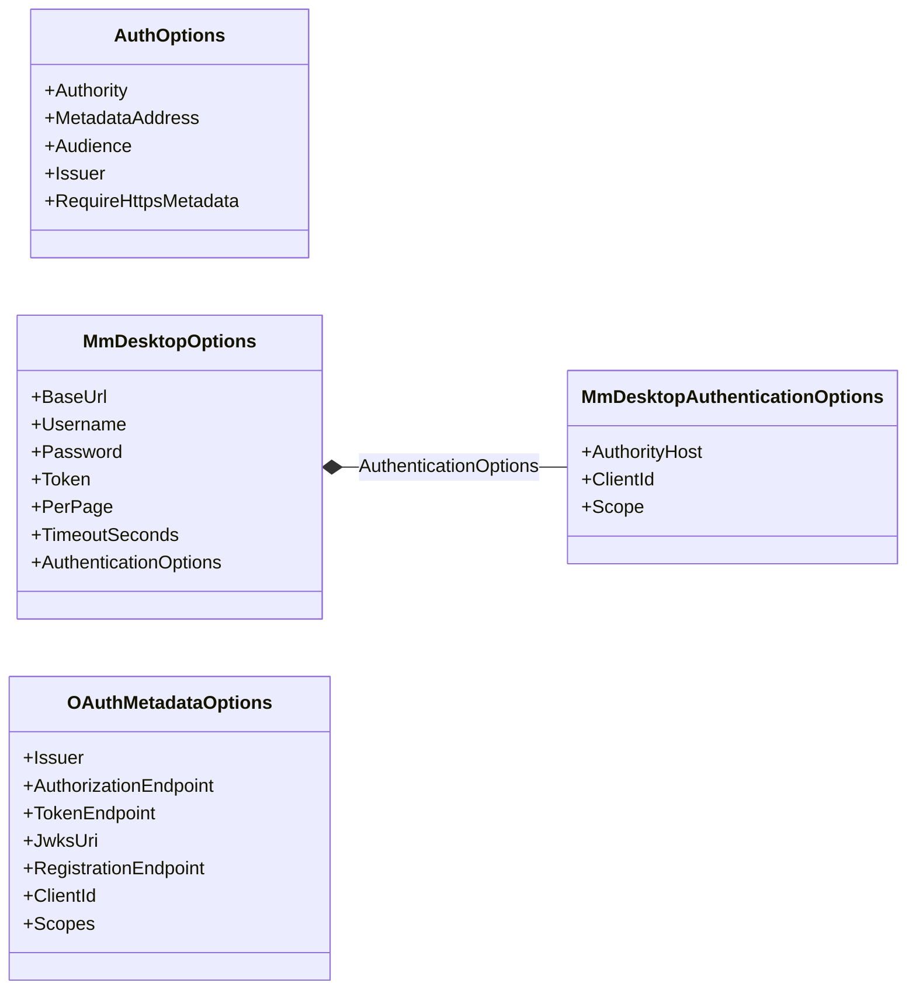

# Class diagram: MattermostMCP

UML-диаграммы классов проекта `src/McpServer` (C# / .NET 10, primary constructors).
Классы сгруппированы по слоям; связи — это композиция (`*--`), агрегация (`o--`),
зависимость (`..>`) и реализация интерфейса (`..|>`). Статические классы и методы
(`Program`, `McpEndpoints`, `McpJsonRpc`, `AuthService`, `OAuthMetadata`) отмечены
по смыслу, а не отдельной нотацией.

## Основные классы (хост, handlers, MmDesktop)

## Модели и контракты (`MmDesktop/Models`, `ThreadSearchContracts`)

## Конфигурация (Options)

## Примечания

- Связь `MattermostClient ..> MattermostAuthHandler` отражает реальную инъекцию
  обработчика через `AddHttpMessageHandler` в `Startup.ConfigureServices`.
- Вложенные generic-типы (`Task<IReadOnlyList<T>>`) в Mermaid намеренно не
  раскрыты: члены коллекций показаны без параметров типа, чтобы не полагаться на
  поддержку вложенных generic в конкретной версии рендерера.
- Приватные `ThreadsWire` / `ThreadWire` внутри `MattermostClient` в диаграмму
  не вынесены — они деталь реализации wire-контракта.
- Проверка синтаксиса: рендеринг Mermaid в этом окружении недоступен (нет
  `mmdc`/Chrome), диаграммы следуют синтаксису Mermaid v10+ для classDiagram.
