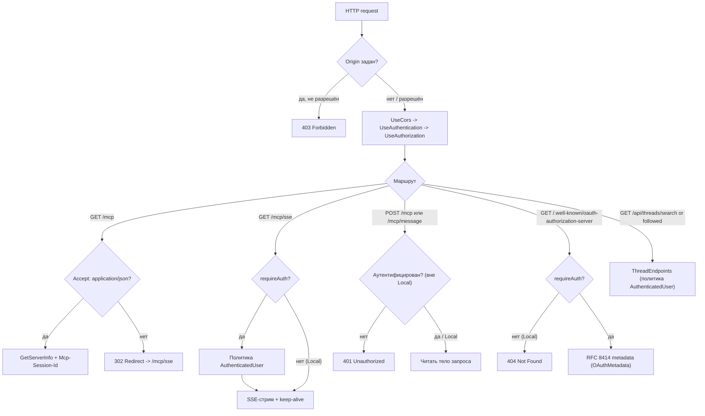
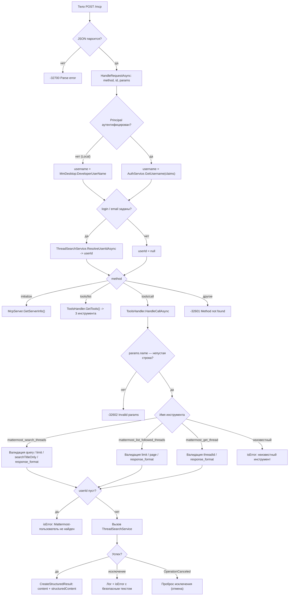

# Control flow: MattermostMCP

Потоки управления проекта `src/McpServer`: сначала проход запроса через middleware
и маршрутизацию, затем диспетчеризация JSON-RPC и выполнение MCP-инструмента.
Основано на `Startup.Configure`, `McpEndpoints.MapMcpEndpoints`,
`McpServer.HandleRequestAsync` и `ToolsHandler.HandleCallAsync`.

## 1. Middleware и маршрутизация HTTP

## 2. Диспетчеризация JSON-RPC и вызов инструмента

## См. также

- [class-diagram.md](class-diagram.md) — классы и связи.
- [data-flow.md](data-flow.md) — потоки данных.
- [sequence.md](sequence.md) — сценарии вызовов.
- [quickstart.md](quickstart.md) — протокол MCP и эндпоинты.
