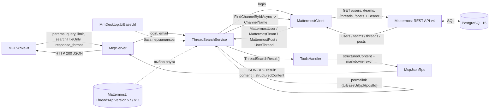
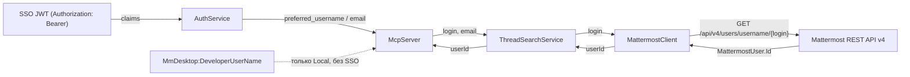

# Data flow: MattermostMCP

Потоки данных проекта `src/McpServer`: как данные превращаются из JSON-RPC-запроса
в REST-вызовы Mattermost, проходят через модели и возвращаются как
`structuredContent` + текстовый блок. Основано на `ThreadSearchService`,
`MattermostClient` и моделях `MmDesktop/Models`.

## 1. Основной путь (поиск по followed threads)

## 2. Идентификация пользователя (SSO -> Mattermost userId)

## Примечания

- `response_format` (`markdown` / `json`) влияет только на текстовый блок
  ответа; `structuredContent` формируется всегда.
- В режиме `v11` данные тредов агрегируются по всем командам пользователя
  (`GetUserTeamsAsync` -> `GetUserThreadsAsync` для каждого `team.Id`).
- `ThreadSearchResult.MattermostUrl` строится локально из `UiBaseUrl`, а не
  приходит из Mattermost.

## См. также

- [class-diagram.md](class-diagram.md) — классы и связи.
- [control-flow.md](control-flow.md) — потоки управления.
- [sequence.md](sequence.md) — сценарии вызовов.
