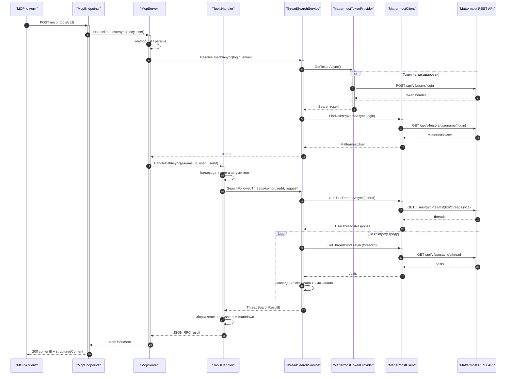
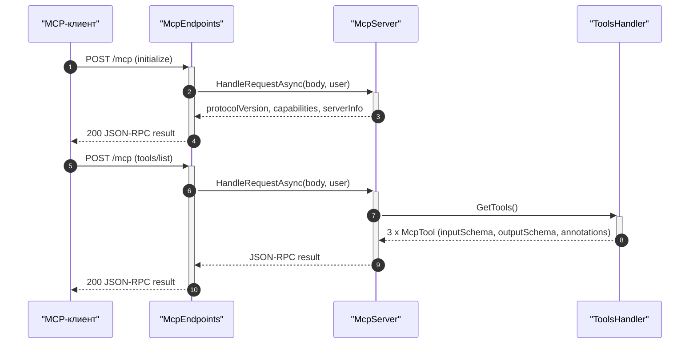
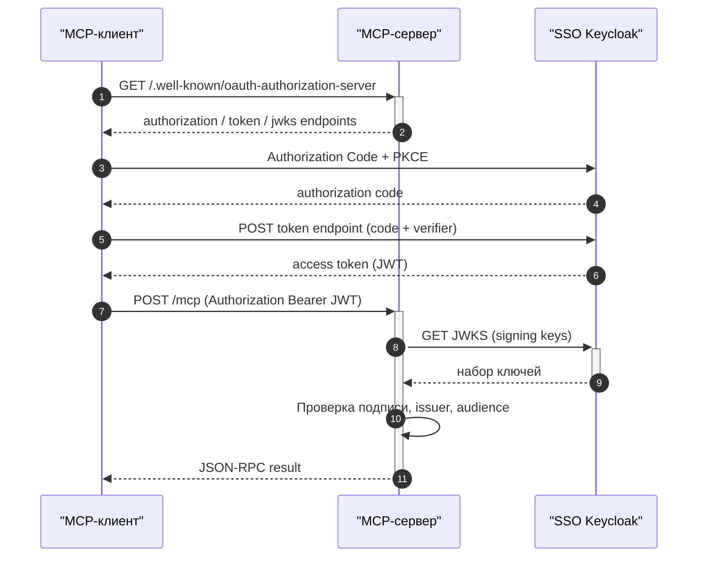

# Sequence: MattermostMCP

Сценарии взаимодействия проекта `src/McpServer`: основной вызов инструмента
(`tools/call`), базовая инициализация и OAuth-поток при включённой авторизации.

## 1. tools/call: поиск по followed threads

## 2. initialize / tools/list

## 3. OAuth 2.0 + PKCE (когда авторизация включена)

## См. также

- [class-diagram.md](class-diagram.md) — классы и связи.
- [control-flow.md](control-flow.md) — потоки управления.
- [data-flow.md](data-flow.md) — потоки данных.
- [quickstart.md](quickstart.md) — протокол MCP и эндпоинты.
